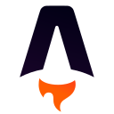

# Dennis Moe

Third-year Computer Engineering student at NTNU in Trondheim, specializing in software engineering (systemutvikling). On the side I build websites and web apps for
small businesses as a one-person studio, Moe Frilans (org.nr 832 202 312), and I run the
infrastructure behind them: domain, DNS, email, hosting.

I came to code after a bachelor's in ancient history, so I care about clear writing and reasoning as much
as shipping.

Open to summer 2027 internships, and part-time work alongside my studies.

*What's here is a mix: client work (mostly private), coursework, and things I'm tinkering with.*

## Selected work

| Project | What it is | Role / status | Links |
|---------|-----------|---------------|-------|
| **Eksamensportalen** | Exam-prep platform for Norwegian students, 5000+ users<br><sub>React Router · Node · Postgres · Stripe/Vipps</sub> | Lead dev V1 (live) · solo on V2 (in progress) | [live](https://eksamensportalen.no) · [case study](https://moefrilans.no/en/work/eksamensportalen) |
| **Insotech** | Bilingual B2B product catalogue with request-for-quote<br><sub>Nuxt · Supabase · Tailwind</sub> | Solo design + build; now their IT contact | [live](https://insotech.no) · [case study](https://moefrilans.no/en/work/insotech) |
| **Xu Consulting** | Fast static site, migrated off Squarespace without losing search rankings<br><sub>Astro · Cloudflare</sub> | Solo; domain / DNS / hosting / SEO | [live](https://xu.no) · [case study](https://moefrilans.no/en/work/xu-consulting) |

## Stack

**Languages**
<p>
  
  
  
</p>

**Frameworks**
<p>
  
  
  
  
  
</p>

**Infrastructure**
<p>
  
  
  
  
</p>

**Learning:** Go (backend side projects) · C++ ([INFT2503](https://www.ntnu.no/studier/emner/INFT2503), NTNU)

## Coursework (NTNU)

| Project | What it is | Role | Links |
|---------|-----------|------|-------|
| **IK-Kontrollsystem** | Internal-control system for a real restaurant client — food safety (IK-Mat) and alcohol compliance logging, replacing paper logbooks<br><sub>Vue 3 · Spring Boot · MySQL · Docker</sub> | Team of 4, grade A · my part: multi-tenant scoping, role-based security, dashboard + checklist modules | [course repo](https://github.com/dennismoe0/IDATT2105-Fullstack) · [team repo](https://github.com/Stcwal/fullstack) |
| **Network programming in Rust** | Course assignments (threads → thread pool → raw HTTP → TLS/UDP → sandboxed code-runner) and an RGA CRDT collaborative editor, Rust compiled to WASM with a React frontend<br><sub>Rust · WebAssembly · axum · React</sub> | Team of 3 on the editor, grade A · assignments solo | [code](https://github.com/dennismoe0/IDATT2104-Nettverksprogrammering) |

## How I work

I use AI heavily and openly. The development speed it enables makes it possible to take on larger
projects for clients than a one-person studio otherwise could. What makes that work is everything
I've built around it: custom CLI tooling and skills, and a review pipeline that checks every diff
before it ships. At its core is [an audit suite I built](https://moefrilans.no/en/quality) and am preparing for public release:
22 quality dimensions, from security and WCAG accessibility to performance, i18n and supply-chain
checks, each finding adversarially verified before it's reported. The design decisions, the
debugging, and the quality bar are mine. The content sites above ship zero JS and score 97–100
on Lighthouse.

## Links

- 🌐 [moefrilans.no](https://moefrilans.no) — my web studio
- 💼 [linkedin.com/in/dennismoe](https://www.linkedin.com/in/dennismoe)
- 📄 [CV](https://moefrilans.no/cv-en.pdf) — [norsk versjon](https://moefrilans.no/cv-no.pdf)
- ✉️ post@moefrilans.no

---

<details>
<summary>👾 me, but make it ASCII <sub>(a portrait — best viewed in dark mode)</sub></summary>
<br>

```text
                           -=++=-     ::::
                       -=**##**+=+==+***++++-:.
                     -=*#%#+-:::--=******+==++=-..
                 :-=###%%#=-:-:---=#%#*==+*+=-==---=
              ::+#*##*#%%%##+=--===***=-::=#*+--+++**+
             --*##+==*%%###+==++=+=-::::.:=***=--****#+
             -**+-:-=+*===-=+#####%*+=---=++====--++*#*:
           :**====+-..:-=+*##%%%%@@@%%####+=:-.=*==+*##+.
           -*##**##*+:-*##%%@@%@@@@@@@@%##*-:-..===++=+*-
           **=+***+++=*#**%%%@@@@@@@@%%+=++-..::.--+*-:::.
           =+++---=---*%%%@@@@@@@@@@@%%=:-=-::::=+-:--:....
            :-+===++-+#@@@@@@@@@@@@@@@%*:-=+=-::--:........
             =:..:=+-*#%@@@@@@@@@@@%%%%%#+-:-===-:.........
              -:..-===-====+*#####*+===-=-:..--:..........
               :.:+=-.:*-...:-=+=-::-*-..................
               ::+#+=++=-....*@@%-..-==-..................
                =#%%%##***##%%@@#+**+++++=---=--::........
                +%@@@@@@@@@@@%@@#*#%%%%%%%%%%##+-:.......
                *%@@@@@@@@%%%@@%#*+*%@@@@@@@%%#+::.......
                *%%%@@@@%%%%%@@%##**%%%@@%%%#*+-:........
                 #####*##%%+-==-:.:-#%#####*+=-::.::::.
                 +**=:+*%%%%#-....:+###*+==--:::::...
                  *=*%#*#=---------=*++*#++=:.::..
                  *####%%#**+++==--::-+*##=:::...
                   **+*%%%%######*+++##**-:.:.....
                    -+*#%%%#*+=====+##*+:.......:.
                     :+*#%@%%@%%%%%%%#+:........:.
                       -+%@@@@@@%%%%*-.........:::.
                        :=***++++==-:...........::..
                        ::::::::::..............:.::.
```

<sub>Real photo → background segmentation → histogram equalization → brightness-to-character mapping, plus a few hand-placed characters for the eyes and mouth. Selectable text, no image. Pipeline in [`ascii-portrait/`](ascii-portrait/). On light theme you get the cursed photo-negative variant.</sub>

</details>
